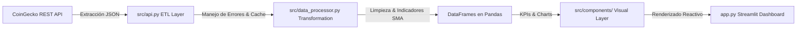

# ⚡ CryptoIntelligence Dashboard

[](https://www.python.org/)
[](https://streamlit.io/)
[](https://pandas.pydata.org/)
[](https://plotly.com/)
[](https://www.python.org/dev/peps/pep-0008/)

Un **Dashboard Interactivo de Datos Financieros y Mercado Cripto** en tiempo real diseñado con arquitectura modular en Python. Consume datos de la API REST pública de CoinGecko, realiza transformaciones y cálculos de indicadores técnicos con **Pandas**, y renderiza visualizaciones reactivas con **Plotly** y **Streamlit**.

---

## 🌟 Características Clave

- **🔌 Pipeline ETL en Tiempo Real:** Extracción automática de precios, volumen, capitalización de mercado e historial desde la API pública de CoinGecko.
- **🛡️ Mecanismo de Resiliencia (Fallback System):** Sistema de caché inteligente (`@st.cache_data`) y generación de datos sintéticos de alta fidelidad que garantizan **100% de disponibilidad** sin caídas ante *Rate Limits*.
- **📈 Indicadores Técnicos Financieros:** Cálculo dinámico de Medias Móviles Simples (**SMA 7 días**, **SMA 30 días**), volatilidad y porcentaje de cambio diario en 24h.
- **🎨 Interfaz de Alto Impacto:** Diseño con paleta oscura moderna (Glassmorphism), tarjetas de métricas KPI y soporte multimoneda (USD, EUR, GBP).
- **🌐 Visión Global del Mercado:** Gráficos interconectados de dominancia por capitalización (Donut chart) y variación del rendimiento en 24h.
- **💾 Exportación de Reportes:** Inspección de datos limpios y descarga directa en formato **CSV**.
- **🧪 Cobertura de Pruebas:** Suite de pruebas unitarias implementadas con **Pytest**.

---

## 🏗️ Arquitectura del Sistema



### Estructura del Repositorio

```text
Proyecto cv/
├── .streamlit/
│   └── config.toml          # Configuración del tema visual oscuro
├── src/
│   ├── api.py               # Extracción y comunicación REST con API
│   ├── data_processor.py    # Transformaciones de datos, SMA y manejo de nulos
│   └── components/
│       ├── sidebar.py       # Panel de controles e interacción
│       ├── metrics.py       # Tarjetas KPI financieras
│       └── charts.py        # Gráficos interactivos Plotly
├── tests/
│   ├── test_api.py          # Pruebas unitarias de API
│   └── test_processor.py    # Pruebas unitarias de transformaciones Pandas
├── app.py                   # Punto de entrada principal de la aplicación
├── requirements.txt         # Lista de dependencias de Python
├── .gitignore               # Archivos ignorados por Git
└── README.md                # Documentación del proyecto
```

---

## 🚀 Instalación y Ejecución Local

### 1. Clonar el repositorio
```bash
git clone https://github.com/TU_USUARIO/crypto-intelligence-dashboard.git
cd crypto-intelligence-dashboard
```

### 2. Crear y activar entorno virtual
```bash
# En Windows:
python -m venv .venv
.venv\Scripts\activate

# En macOS/Linux:
python3 -m venv .venv
source .venv/bin/activate
```

### 3. Instalar dependencias
```bash
pip install -r requirements.txt
```

### 4. Ejecutar el Dashboard
```bash
streamlit run app.py
```
La aplicación se abrirá automáticamente en tu navegador web en `http://localhost:8501`.

---

## 🧪 Ejecución de Pruebas Unitarias

Para verificar la integridad del procesador de datos y los módulos de API:

```bash
pytest -v
```

---

## ☁️ Despliegue en la Nube (1-Click en Streamlit Cloud)

Este proyecto está optimizado para su despliegue gratuito en **Streamlit Community Cloud**:

1. Sube este repositorio a tu cuenta de **GitHub**.
2. Ingresa a [share.streamlit.io](https://share.streamlit.io/).
3. Selecciona tu repositorio, rama `main` y archivo principal `app.py`.
4. Haz clic en **Deploy**. ¡Tu enlace web activo estará listo en menos de 2 minutos!

---

## 🛠️ Tecnologías Utilizadas

- **Lenguaje:** Python 3
- **Framework Web:** Streamlit
- **Procesamiento de Datos:** Pandas, NumPy
- **Visualización:** Plotly Graph Objects / Express
- **Peticiones HTTP:** Requests
- **Testing:** Pytest

---

## 👤 Autor

Desarrollado como proyecto de portafolio para demostración de capacidades en **Data Engineering, Análisis de Datos y Desarrollo Python**.
